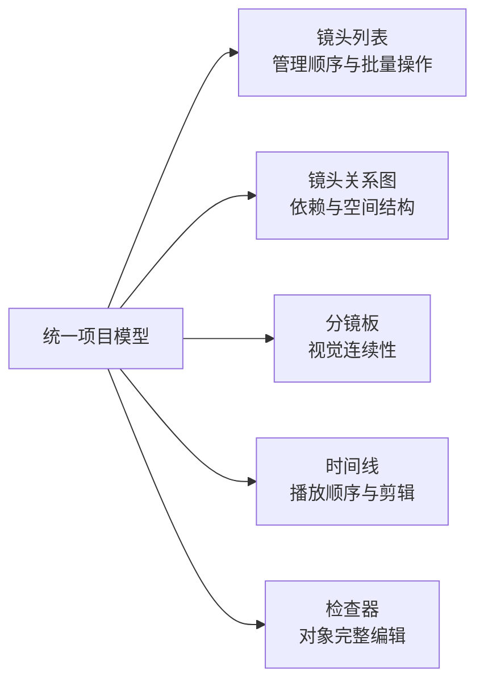
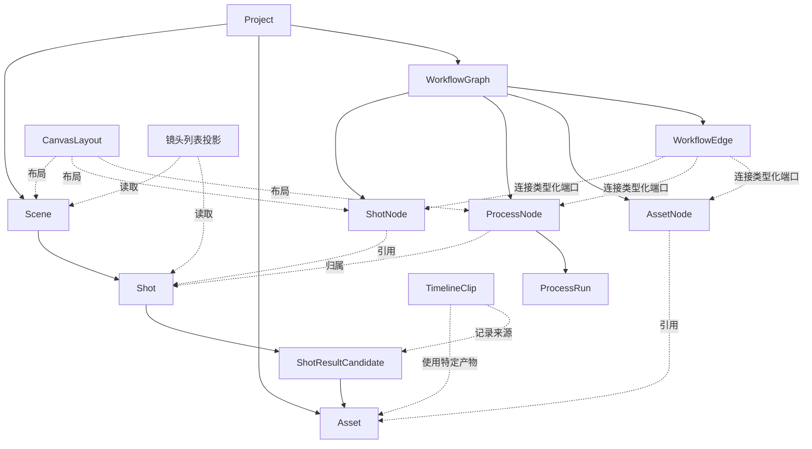

# 镜头关系图与镜头列表互补视图设计

**状态：** 已确认

**日期：** 2026-09-27

**关联决策：** ADR 0007、ADR 0008、ADR 0009、ADR 0010

**参考实现：** [React Flow](https://reactflow.dev/)、[BeefTV](https://github.com/glanderness/BeefTV)、[basketikun/infinite-canvas](https://github.com/basketikun/infinite-canvas)

## 1. 目标

把“镜头列表”和“节点画布”设计成同一份项目数据的两个互补视图，而不是两个互相复制、互相覆盖的编辑器：

- 镜头列表负责稳定浏览、排序、批量管理和状态扫描。
- 镜头关系图负责表达依赖、分支、复用、场景分组和流程上下文。
- 分镜板负责视觉连续性检查。
- 时间线负责真实播放位置和本地剪辑。
- 检查器负责一个对象的完整编辑，避免列表卡片、画布节点各自维护一套表单。

最终 AI 视频生成继续在外部工具完成。本设计扩展的是复刻准备、关系表达、结果管理和本地收尾能力，不恢复浏览器直连生成服务、插件市场或通用无限画布范围。

## 2. 成功标准

完成后的工作区必须满足：

1. 同一个制作镜头在列表、关系图、分镜板和时间线来源定位中具有同一稳定身份。
2. 从任一视图选择镜头，其他已打开视图能定位并显示同一对象；悬停只产生瞬时提示，不改变选择或历史。
3. 列表重排只改变镜头管理顺序，画布拖动只改变布局，时间线移动只改变剪辑位置，连线只改变工作流依赖。
4. 镜头内容、工作流关系和画布布局分别保存、分别冲突检测；布局变化不会使结果失效。
5. 项目视图不会一次渲染所有镜头的全部流程节点，千节点级项目仍可通过层级聚焦、虚拟列表和可见区域渲染操作。
6. P0 能从现有列表式镜头步骤无损迁移，并保留素材、步骤状态、产物、结果候选和关联快照。

## 3. 非目标

- 不建设任意类型节点、任意脚本和任意远程插件组成的通用低代码平台。
- 不允许浏览器保存 API Key 并直连生成服务。
- 不引入动态 URL 安装节点、自定义 JavaScript 请求脚本或 WebDAV 主存储。
- 不建设通用图片编辑器、Three.js 多角度编辑器或浏览器 FFmpeg 工作流编排器。
- 不把最终 AI 视频生成重新放回应用。
- 不直接采用 BeefTV 或 basketikun 的浏览器本地数据格式、完整画布组件或业务运行时。
- P0 不开放跨镜头流程依赖编辑、任意自由分组和多套剪辑序列。

## 4. 核心产品模型

### 4.1 一个模型，五种投影



视图不是数据所有者。任何编辑先转换为领域命令，经过同一规则校验和持久化，再由各视图投影最新快照。不得通过组件间回调分别修改两份状态。

### 4.2 四种必须分离的顺序

| 含义 | 权威字段 | 主要视图 | 明确不影响 |
| --- | --- | --- | --- |
| 镜头管理顺序 | `Shot.rank` | 镜头列表、分镜板 | 时间线位置、节点位置、依赖 |
| 成片时间顺序 | `TimelineClip.start`、轨道 | 时间线 | 镜头排序、画布布局 |
| 工作流依赖 | `WorkflowEdge` | 镜头关系图 | 镜头排序、时间线位置 |
| 空间位置 | `CanvasLayout.position` | 镜头关系图 | 内容修订、结果有效性、交付快照 |

任何跨模型同步都必须是用户触发且可预览差异的显式命令。例如“根据镜头顺序创建/更新时间线”，而不是拖动列表后静默移动所有剪辑片段。

## 5. 领域模型

### 5.1 Scene

```ts
type Scene = {
  id: string;
  projectId: string;
  title: string;
  rank: string;
  description: string;
};
```

`Scene` 是镜头的语义分组和画布容器，不是可运行节点。它用于叙事段落、地点或视觉连续性组织，不表达时间线轨道，也不隐含工作流依赖。

### 5.2 Shot

```ts
type Shot = {
  id: string;
  projectId: string;
  sceneId: string;
  rank: string;
  title: string;
  duration: number;
  creativeSpec: {
    prompt: string;
    negativePrompt: string;
    shotSize?: string;
    cameraMotion?: string;
    characterAssetIds: string[];
    sceneAssetIds: string[];
    referenceAssetIds: string[];
  };
  adoptedResultId: string | null;
};
```

镜头承载创作意图、素材引用和采用结果。模型、种子、采样等执行参数属于流程节点配置或可复用配方，不属于镜头本体。

### 5.3 WorkflowNode

```ts
type WorkflowNode =
  | { id: string; type: "shot"; shotId: string }
  | {
      id: string;
      type: "process";
      ownerShotId: string;
      processKind: string;
      config: Record<string, unknown>;
    }
  | {
      id: string;
      type: "asset";
      assetId: string;
      ownerShotId?: string;
      role?: string;
    };
```

每个镜头恰好有一个规范 `ShotNode`。`ProcessNode` 表示准备操作，`AssetNode` 表示项目素材的关系引用；两者都不能替代镜头身份。

### 5.4 WorkflowEdge

```ts
type WorkflowEdge = {
  id: string;
  source: { nodeId: string; portId: string };
  target: { nodeId: string; portId: string };
  kind: "data";
};
```

P0 只支持有向数据依赖。端口来自受控节点目录，连接时校验数据类型、所有权和有向无环约束；不允许用自由文本或节点坐标推断依赖。

### 5.5 CanvasLayout

```ts
type CanvasLayout = {
  scope: { type: "project" | "scene" | "shot"; id: string };
  layoutRevision: number;
  nodes: Record<string, {
    x: number;
    y: number;
    width?: number;
    height?: number;
    collapsed?: boolean;
  }>;
  viewport?: { x: number; y: number; zoom: number };
};
```

布局使用独立 `layoutRevision`。节点移动、场景折叠和视口变化不得增加内容修订、传播 stale 状态或改变交付快照。

### 5.6 运行与结果

```ts
type ProcessRun = {
  id: string;
  nodeId: string;
  workspaceRevision: number;
  status: "queued" | "running" | "completed" | "failed" | "cancelled";
  progress?: number;
  inputSnapshot: unknown;
  outputAssetIds: string[];
  error?: { code: string; message: string };
};

type ShotResultCandidate = {
  id: string;
  shotId: string;
  assetId: string;
  adopted: boolean;
  adoptionReason?: string;
};
```

沿用现有结果候选、采用理由、关联快照和稳定素材引用。运行状态、镜头准备状态、结果审核状态和时间线使用状态必须分开，不能压缩成一个含义模糊的 `Shot.status`。

### 5.7 关系总览



P0 不增加 `Sequence` 实体。`Shot.rank` 已表达管理和叙事顺序，时间线负责播放顺序，边负责依赖，布局负责空间；只有产品未来确实支持多个平行剪辑方案时，才引入 `CutSequence`。

## 6. 信息架构与响应式布局

### 6.1 桌面布局

在全站应用框架内，工作区采用：

```text
┌──────────────────── 工作区工具栏 ────────────────────┐
│ 视图切换 / 层级面包屑 / 搜索筛选 / 布局 / 保存状态   │
├──────────────┬──────────────────────────┬─────────────┤
│ 镜头列表     │ 镜头关系图               │ 检查器      │
│ 约 280px     │ 弹性宽度                 │ 约 340px    │
│ 可收起       │ 视觉中心                 │ 可收起      │
├──────────────┴──────────────────────────┴─────────────┤
│ 运行队列抽屉（按需展开）                              │
└───────────────────────────────────────────────────────┘
```

- `≥1280px`：默认“分屏”，列表、画布、检查器同时可见。
- `900–1279px`：列表与画布并列，检查器使用侧边抽屉。
- `<900px`：列表与画布单视图切换，默认镜头列表；检查器全屏抽屉。
- P0 提供“分屏 / 画布 / 列表”三种模式；分镜板和时间线入口在 P1 接入。

### 6.2 层级聚焦与语义缩放

- 项目层：显示场景框、镜头节点和必要的跨镜头关系，不显示全部流程节点。
- 场景层：显示当前场景镜头；选中镜头时可显示一层相邻关系。
- 镜头层：显示该镜头的素材、流程节点、端口和输出。
- 工具栏面包屑固定为“项目 / 场景 / 镜头”，返回上层只改变视图范围，不修改数据。

语义缩放不仅改变尺寸，也改变信息密度：低缩放只显示名称、缩略图和聚合状态；中缩放显示主要端口与问题；高缩放显示流程摘要。完整字段始终在检查器中编辑。

## 7. 跨视图交互契约

### 7.1 统一选择状态

```ts
type SelectionState = {
  primaryEntity:
    | { type: "shot"; id: string }
    | { type: "processNode"; id: string }
    | { type: "scene"; id: string }
    | null;
  selectedShotIds: Set<string>;
  hoveredEntity: { type: string; id: string } | null;
};
```

- 点击列表镜头：更新共享选择命令，画布显露、定位并高亮规范 ShotNode，检查器打开该镜头。
- 点击画布 ShotNode：列表滚动到对应镜头，检查器打开镜头。
- 点击 ProcessNode：检查器打开流程节点；列表只弱高亮其所属镜头，不加入镜头批量选择。
- 点击 Scene：列表定位对应场景区段，检查器打开场景摘要。
- 悬停只做临时联动，不滚动、不居中、不写历史、不持久化；键盘焦点使用同等视觉反馈。
- `Cmd/Ctrl+点击` 增减镜头选择，列表 `Shift+点击` 做连续范围选择；项目/场景层画布框选只选择镜头。

组件间不得形成 `Canvas -> List -> Canvas` 回调环。所有操作采用“命令 -> store -> 选择器 -> 视图”的单向流。

### 7.2 拖放与连线

| 操作 | 结果 |
| --- | --- |
| 列表内拖动镜头 | 只更新 `Shot.rank` |
| 画布拖动节点 | 只更新当前范围的 `CanvasLayout` |
| 把镜头拖入场景框 | 更新 `Shot.sceneId`，保留其镜头身份 |
| 从列表拖到画布 | 定位或重新摆放已有规范 ShotNode，不创建重复镜头 |
| 在画布中新建镜头 | 原子创建 `Shot`、规范 ShotNode 和初始布局 |
| 从端口拖出连接 | P1 起创建经类型和 DAG 校验的 `WorkflowEdge`；P0 关系只读 |
| 素材拖入镜头聚焦视图 | P1 起创建引用该项目素材的 AssetNode |
| 流程节点拖到另一镜头 | P0 禁止；未来必须使用显式“移动/复制并预览影响”命令 |

自动排布只能由用户显式触发，只作用于当前范围内未锁定节点；排布不得更改镜头顺序或依赖。

### 7.3 场景框

场景框显示名称、镜头数、总计划时长和聚合问题。折叠后用摘要节点代替内部节点；移动场景框不改变场景排名或镜头排名。删除场景必须先展示把镜头迁移到其他场景或同时删除的影响，不允许静默级联。

P0 不提供任意自由分组。自由框选分组只有在出现明确、重复的业务需求后才进入 P2。

### 7.4 搜索与筛选

搜索条件由列表和画布共享：列表过滤卡片，画布默认保留结构并弱化非匹配对象；用户可显式选择“仅显示匹配项”。折叠场景显示命中数量。搜索、筛选和视图聚焦不进入撤销历史。

## 8. 各视图职责

### 8.1 镜头列表

- 默认使用视觉卡片，允许切换紧凑密度。
- 卡片显示缩略图、名称、时长、准备状态、候选数量和问题摘要。
- 悬停操作只保留“打开、复制、在画布定位、更多”。
- 批量选择后在统一多选检查器执行兼容操作。
- 长列表使用 `@tanstack/react-virtual`，不自建虚拟滚动。

### 8.2 镜头关系图

- 使用 `@xyflow/react` 处理缩放、平移、选择、连线、键盘焦点和可见区域渲染。
- XYFlow 的 `nodes`/`edges` 数组只是一层展示适配，不是业务事实来源。
- 节点样式沿用 `design.md` 的浅色工作区、紫色选择态和既有语义状态，不照搬参考项目的深色主题。
- 小地图不是 P0 必需；层级面包屑、搜索和“适配当前范围”优先解决导航。真实项目验证仍需要时再启用 React Flow MiniMap。

### 8.3 检查器

检查器是详细编辑的唯一来源：

- 镜头：预览、基础信息、提示词、镜头语言、素材、时长、结果候选、采用历史、问题。
- 流程节点：类型、端口、参数、状态、输入快照、产物、错误和运行操作。
- 场景：名称、说明、镜头数、总时长和聚合问题。
- 多选：只展示所有对象都支持的批量操作，不混合不可比较字段。

列表卡片和画布节点只提供摘要及少量高频操作，避免三套表单产生不同校验规则。

### 8.4 分镜板与时间线

分镜板在 P1 提供按 Scene 分段的大图浏览、相邻镜头对比和 `Shot.rank` 重排。

时间线继续保持独立领域：

- TimelineClip 引用具体 Asset 或结果候选，而不是“镜头当前结果”的浮动指针。
- 同一镜头结果可在时间线出现多次。
- 镜头列表重排不移动时间线片段。
- “根据镜头顺序创建/更新时间线”必须展示新增、保留、移动和冲突差异后再执行。
- 时间线选中片段可定位其来源镜头；更换镜头采用结果不得静默替换已有片段。

### 8.5 运行队列

底部区域命名为“运行队列”，只显示应用实际执行的本地分析、素材处理或准备操作。暂停、取消、提高优先级仅在执行器真实支持时显示。未来若接入外部生成适配器，继续复用 ProcessRun 快照与状态模型，但不改变本设计的产品边界。

## 9. 状态管理与模块边界

### 9.1 前端状态

采用 Zustand 建立一个工作区 store，按职责拆分：

- `entities`：规范化 Scene、Shot、WorkflowNode、WorkflowEdge、候选和运行摘要。
- `order`：场景与镜头排名投影。
- `selection`：主对象、多选镜头和悬停。
- `view`：视图模式、聚焦范围、搜索与筛选。
- `layout`：当前范围布局与布局保存状态。
- `persistence`：内容修订、保存状态、冲突和迁移信息。

所有用户动作通过 `dispatch(command)` 进入。组件按 ID 和窄选择器订阅，不能让一次选择或节点移动重渲染整个列表与画布。

### 9.2 后端深模块

```ts
interface WorkflowWorkspace {
  read(projectId: string): WorkspaceSnapshot;
  apply(
    projectId: string,
    expectedRevision: number,
    command: WorkflowCommand,
  ): ChangeResult;
}

interface CanvasLayoutStore {
  read(projectId: string, scope: LayoutScope): CanvasLayout;
  apply(
    projectId: string,
    expectedLayoutRevision: number,
    command: LayoutCommand,
  ): LayoutResult;
}
```

`WorkflowWorkspace` 隐藏身份、排名、端口类型、DAG、跨镜头规则、stale 传播、删除影响、素材引用、候选快照、CAS 和交付检查。`CanvasLayoutStore` 只拥有位置、尺寸、折叠和视口。调用方不得分别拼装这些规则。

现有全量 workspace PUT 可在迁移期由兼容适配器保留；新交互逐步改为小粒度命令并继续使用 expected revision 防止覆盖保存。

### 9.3 撤销与副作用

- 领域命令和布局命令分别记录；批量操作作为一个事务撤销。
- 选择、悬停、搜索、筛选、检查器开关、平移、缩放和聚焦不进入撤销。
- 运行本地处理、FFmpeg 或外部服务是副作用；撤销只能恢复领域引用，不能声称撤销已发生的外部执行。

## 10. 技术选型与参考项目复用

### 10.1 直接采用

| 能力 | 选择 | 原因 |
| --- | --- | --- |
| 节点画布 | `@xyflow/react` | 已具备分组、连线、选择、键盘、MiniMap 和可见区域渲染，避免从零实现交互内核 |
| 工作区状态 | `zustand` | 适合按实体 ID 做细粒度订阅，并与 XYFlow 的展示状态解耦 |
| 列表虚拟化 | `@tanstack/react-virtual` | 支持可变高度镜头卡片和滚动定位 |
| 自动排布 | `elkjs`（P1） | 适合显式触发的分层 DAG 布局，可放入 Worker |

### 10.2 从 BeefTV 吸收

- 操作先返回影响范围和后置条件，再决定聚焦、选中或提示。
- 场景框折叠、放置和聚合显示的交互模式。
- 搜索结果定位与视口提交分离，避免每次平移都写持久化。

这些模式按本项目领域重新实现；不复制其生成服务、插件、自定义脚本、浏览器存储和整套画布组件。

### 10.3 从 basketikun/infinite-canvas 吸收

- 空格拖动画布、工具模式和多选反馈等直接的空间交互。
- 显式的 `selectedNodeIds` 与 viewport 状态。
- 分支结果在画布上并置比较的视觉思路。

不采用其 React 19/Tailwind/AntD/生成业务耦合的完整实现，也不引入 Excalidraw、Three.js、浏览器 FFmpeg、渠道商城、计费或 Agent 记忆系统。

### 10.4 许可证与来源记录

两个参考仓库均以 MIT 许可公开。若后续复制非平凡代码，必须在对应源码或第三方许可清单中记录仓库、文件、提交和许可证；仅吸收产品模式和重新实现时，也在实现 PR 中注明参考来源。

## 11. 性能与可访问性

### 11.1 性能预算

- 项目层不展开全部 ProcessNode；通过项目、场景、镜头三级范围控制单次渲染量。
- 镜头列表虚拟化；画布只渲染当前范围并评估 XYFlow 的 `onlyRenderVisibleElements`。
- 折叠 Scene 的内部边聚合显示，低缩放隐藏次要标签和端口。
- 缩略图及派生预览懒加载，节点使用稳定引用和 `React.memo`。
- 拖动期间只更新内存位置，`drag stop` 时提交一次布局命令。
- ELK 排布在 Worker 中执行，只在用户显式触发后一次性提交结果。
- 单个选择或节点移动不得导致整棵列表和全部节点重渲染。
- 目标：常用选择和悬停路径不产生超过 50ms 的主线程长任务；总计约 1000 个节点的项目可通过范围聚焦流畅操作。

### 11.2 键盘与辅助技术

- `Space + 拖动`：平移画布。
- 滚轮/触控板：缩放或平移，遵循系统习惯。
- `Cmd/Ctrl+0`：适配当前范围。
- `F`：聚焦选择。
- `Enter`：打开检查器。
- `Cmd/Ctrl+F`：搜索。
- `Cmd/Ctrl+点击`：增减多选；列表 `Shift+点击`：范围选择。
- `Cmd/Ctrl+Z`、`Cmd/Ctrl+Shift+Z`：撤销与重做。
- `Delete/Backspace`：执行带影响说明的删除。
- `Esc`：关闭浮层或清除当前选择。

输入框和可编辑文本获得焦点时禁用画布快捷键。节点、端口、连接和聚合状态必须有可读名称，不能只靠颜色区分。

## 12. 组件与目录建议

```text
ShotWorkflowWorkspace
├── WorkspaceToolbar
├── ShotListPanel
│   ├── SceneSection
│   ├── VirtualizedShotList
│   └── ShotCard
├── WorkflowCanvas
│   ├── SceneGroupNode
│   ├── ShotNode
│   ├── ProcessNode
│   ├── AssetNode
│   └── WorkflowEdge
├── WorkspaceInspector
│   ├── ShotInspector
│   ├── ProcessInspector
│   ├── SceneInspector
│   └── MultiSelectionInspector
└── RunDrawer
```

逻辑建议分为：

- `workflow-domain/`：命令、实体、端口目录、校验和投影。
- `workspace-store/`：Zustand slices、命令调度和 API 同步。
- `canvas-adapter/`：领域快照到 XYFlow 节点/边的适配及事件翻译。

`PreproductionWorkspace.tsx` 逐步退化为路由级协调器，不再同时承担数据加载、领域规则、画布、列表、检查器、时间线和运行逻辑。

## 13. 数据迁移

现有 schema v1 到 v2 的迁移规则：

1. 创建默认 Scene“未分场”。
2. 按现有镜头数组顺序生成稳定 `Shot.rank`。
3. 每个现有制作镜头创建一个规范 ShotNode。
4. 镜头内旧节点转换为归属该镜头的 ProcessNode。
5. 旧 `input` 中的项目素材引用转换为 AssetNode 与类型化边；步骤引用转换为 ProcessNode 间的边。
6. 原样保留镜头 ID、节点 ID、状态、错误、产物、结果候选和关联快照。
7. 按列表排名生成可读的初始布局，布局使用独立修订。
8. 首次成功保存 v2 前保留 v1 备份；迁移失败不得覆盖原数据。

迁移函数必须幂等。发布过渡期允许旧端点通过兼容适配器读写 v2，但不得长期保留两套事实来源。

## 14. 分阶段交付

### P0：互补视图基础

- 引入 XYFlow、Zustand、TanStack Virtual。
- schema v2、幂等迁移和兼容适配。
- Scene、Shot、WorkflowNode、WorkflowEdge、CanvasLayout。
- 新镜头卡片列表及“分屏 / 画布 / 列表”。
- Scene 框、ShotNode 和现有依赖的只读关系展示。
- 共享选择、悬停、定位和检查器。
- 独立布局持久化及基础撤销/重做。
- 最终 AI 生成继续在外部完成。

P0 刻意把关系编辑设为只读，先验证模型、迁移、跨视图同步和性能；现有镜头步骤仍可通过检查器编辑。

### P1：可编辑工作流与连续性

- ProcessNode 编辑、类型化端口、连线校验、分支和合并。
- 场景/镜头聚焦、共享搜索筛选。
- 分镜板、候选历史、运行队列和时间线来源桥接。
- ELK 自动排布和兼容批量操作。
- 把现有全局运行锁逐步缩小到互不依赖的子图范围。

### P2：高级编排

- 经验证后开放跨镜头依赖、帧连续性和可复用模板/子流程。
- 多套保存布局、可选 CutSequence、边与场景聚合。
- 删除/移动的完整影响预览和操作后置条件。
- 仅在边界重新确认后考虑协作、Agent 或外部生成适配器。

## 15. 验证策略

### 15.1 领域与迁移

- v1 示例和真实备份迁移后对象数量、ID、产物及关联不丢失。
- 重复迁移输出相同；失败不写回。
- 端口类型、环检测、跨镜头限制、删除影响和 stale 传播有独立测试。
- 内容 CAS 与布局 CAS 互不干扰。

### 15.2 交互

- 列表选镜头、画布选镜头、选流程节点、场景折叠和多选均验证双向定位且无回调循环。
- 分别验证列表重排、画布拖动、时间线移动、连线不会修改其他三种顺序。
- 搜索、悬停、平移和缩放不产生撤销记录或内容保存。
- 键盘路径、焦点恢复、输入框快捷键隔离和窄屏单视图切换可用。

### 15.3 性能

- 使用包含约 1000 个总节点、多个折叠 Scene 的基准项目。
- 记录首次进入、范围切换、选择、框选、拖动和列表滚动的渲染次数及主线程任务。
- 验证单镜头变化只更新相关卡片、节点和检查器，不刷新整个工作区。

## 16. 已拒绝方案

### 16.1 继续只用镜头列表

实现成本最低，但不能清楚表达复用、分支、合并和复杂依赖，随着自由度提高会把关系继续藏在下拉框和列表顺序里。

### 16.2 以无限画布取代镜头列表

空间自由度高，但稳定排序、批量管理、快速扫描、键盘操作和窄屏使用明显退化，也容易让坐标被误当作业务顺序。

### 16.3 完整移植 BeefTV 或 basketikun/infinite-canvas

两个项目都提供有价值的交互参考，但完整实现与各自生成服务、插件、存储、React 版本和 UI 栈耦合。移植会引入本项目明确排除的能力和第二套数据模型。

### 16.4 从零实现画布交互内核

缩放、平移、框选、键盘、端口、分组、可访问性和性能边界成本高且已有成熟开源实现，因此采用 React Flow 作为渲染与交互适配层。
